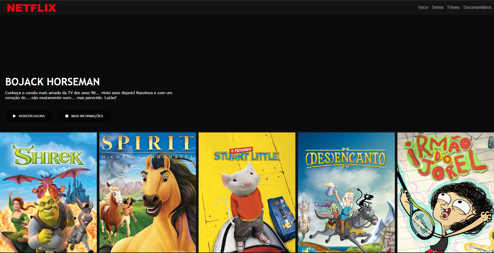

<h2 align="center">
    Recreating Netflix Interface
</h2>

 Recriação de Página Home do Streaming Netflix. 

    
## 👨🏻‍💻 Sobre o projeto

 Recriando um dos mais famosos sites de streaming do mundo utilizando tecnologias simples como HTML5, CSS3 e JavaScript.
Estruturando layout, écnicas de CSS3 com container e variáveis, posicionamento de elementos com Flexbox e utilização de plugins Jquery.

## :movie_camera: Resultado da Recriação

 Para acessar a página recriada por mim, basta fazer download deste repositório e abrir o arquivo index.html em seu navegador. Deve ser aberta uma
página igual a imagem mostrada abaixo. 

 

   

